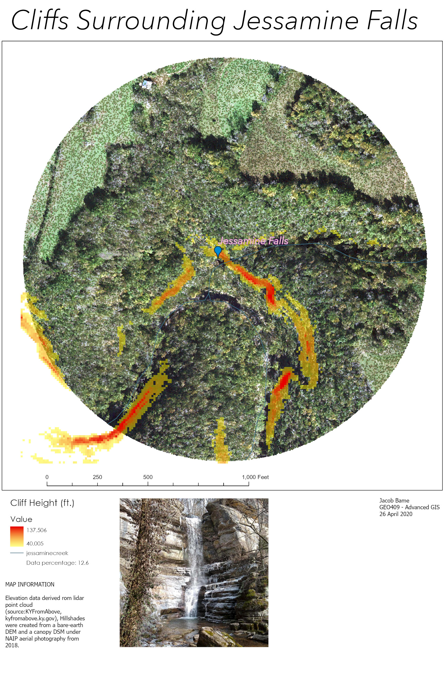

# Jessamine Creek Gorge (JCG)
This is my repository for Jessamine Creek Gorge in GEO409! (called rrg for class consistency). From here I can share my maps with the world!
## Check out this Project!

## [Home](https://JBCurlz.github.io/rrg) | [Cliff Index (L8)](L8/index.html) | [Mapbox Webmap (L8)](L8/map.html) | [Videographic Tour (L7)](https://www.youtube.com/watch?v=C5QH-pajTf8) | [GeoPDF of JCG (L6)](basemap/jcg.pdf)

## Cliffs in Jessamine Creek Gorge and an Aerial Tour (Lab 7)

This map shows where cliffs are located directly surrounding Jessamine Falls.

[Here is a video aerial tour past Jessamine Falls!](https://www.youtube.com/watch?v=C5QH-pajTf8)

<iframe width="560" height="315" src="https://www.youtube.com/embed/C5QH-pajTf8" frameborder="0" allow="accelerometer; autoplay; encrypted-media; gyroscope; picture-in-picture" allowfullscreen></iframe>

## A Base map of Jessamine Creek Gorge (Lab 6)
[Download a GeoPDF of Jessamine Creek Gorge](basemap/jcg.pdf)

REMINDER: Please respect Nicholasville law enforcement and avoid visiting the trails if they are closed for quarantine. :)

     
*Preview of map*

## Photographs

All images taken by Jacob Bame, January 2020.