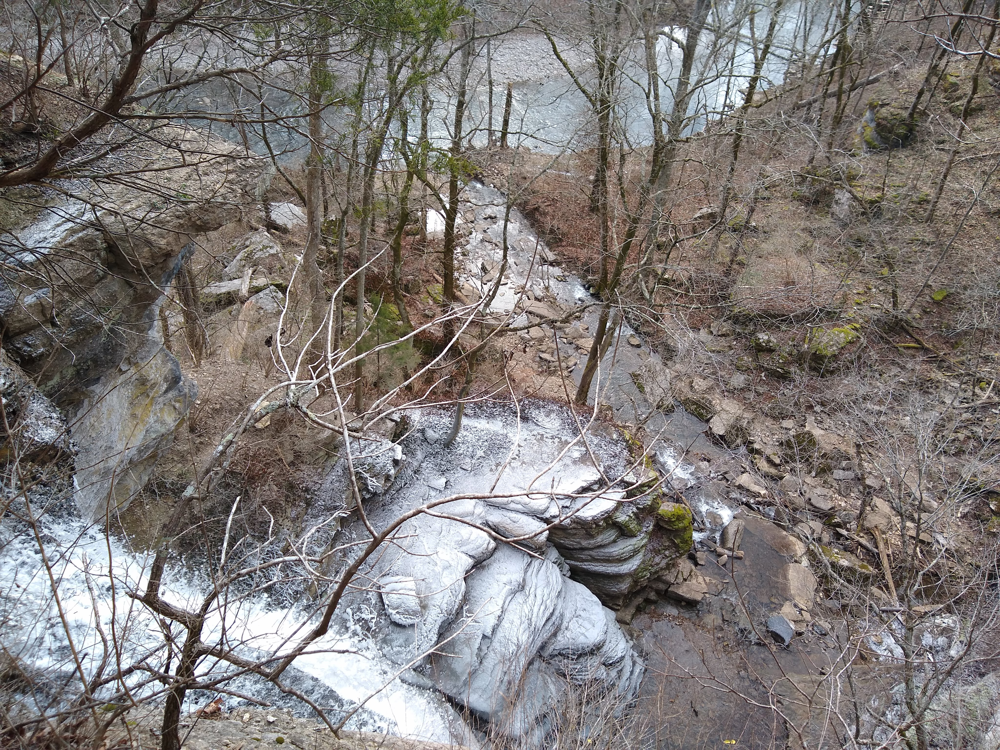

# rrg
This is my repository for Jessamine Creek Gorge in GEO409! (called rrg for class consistency). From here I can share my maps with the world!
## Visit the web page

[JBCurlz.github.io/rrg](https://JBCurlz.github.io/rrg)

## Lab 7 Update: Cliffs in Jessamine Creek Gorge and an Aerial Tour

This map shows where cliffs are located directly surrounding Jessamine Falls.

[This link will take you to an aerial tour past Jessamine Falls!](https://www.youtube.com/watch?v=C5QH-pajTf8)

## A Base map of Jessamine Creek Gorge (Lab 6)
[Download a GeoPDF of Jessamine Creek Gorge](basemap/jcg.pdf)

REMINDER: Please respect Nicholasville law enforcement and avoid visiting the trails if they are closed for quarantine. :)

     
*Preview of map*

## Photographs

All images taken by Jacob Bame, January 2020.